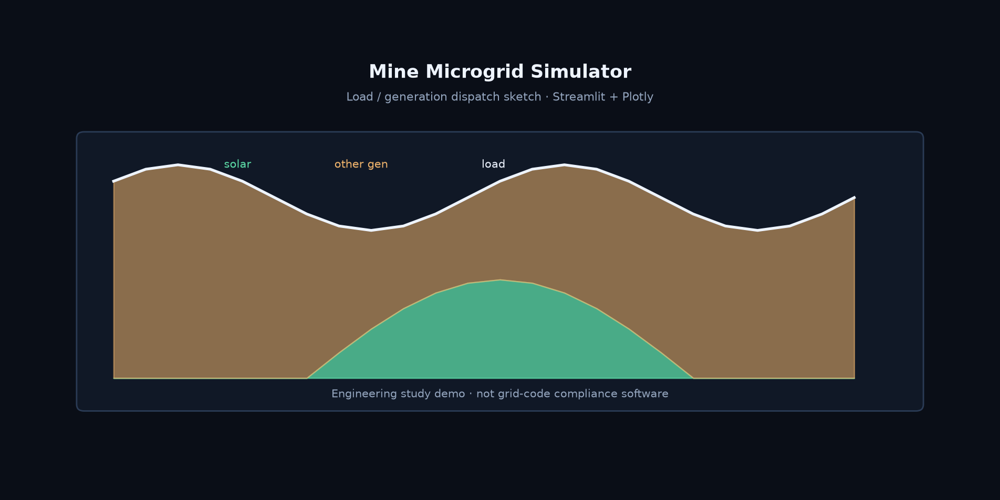

# Mine Microgrid Simulator

**Streamlit + Plotly microgrid planning demo for mining load / generation scenarios.**

[English](README.md) | [中文](README.zh-CN.md)

[](https://github.com/Phoenix0531-sudo/Mine_Microgrid_Simulator/actions/workflows/ci.yml)
[](LICENSE)

Engineering study UI: scenario modules under `modules/`, interactive charts via Plotly, Streamlit entry for what-if dispatch and cost sketches. Not a grid-code compliance product.

## Preview



## Layout

```
modules/     # planning / analysis modules
scripts/
tests/
docs/
```

## Install / run

```bash
git clone https://github.com/Phoenix0531-sudo/Mine_Microgrid_Simulator.git
cd Mine_Microgrid_Simulator
pip install -r requirements.txt
streamlit run app.py   # or entry documented in modules/
pytest tests/
```

## License

MIT. See [LICENSE](LICENSE).
